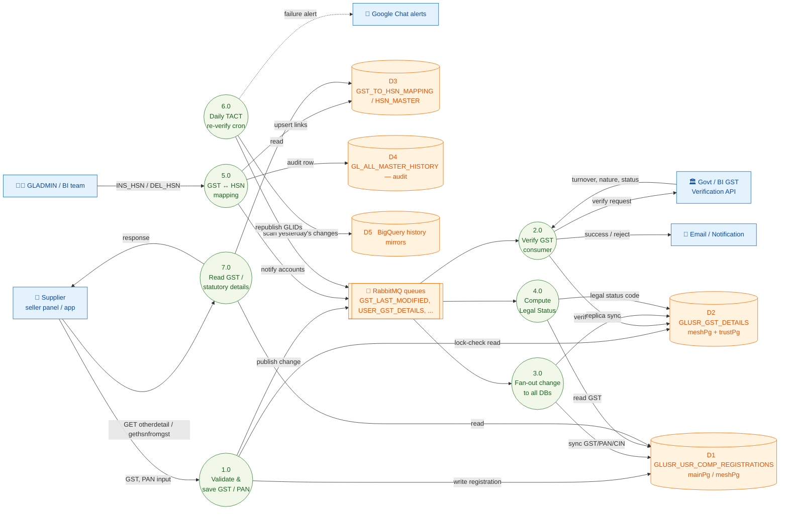
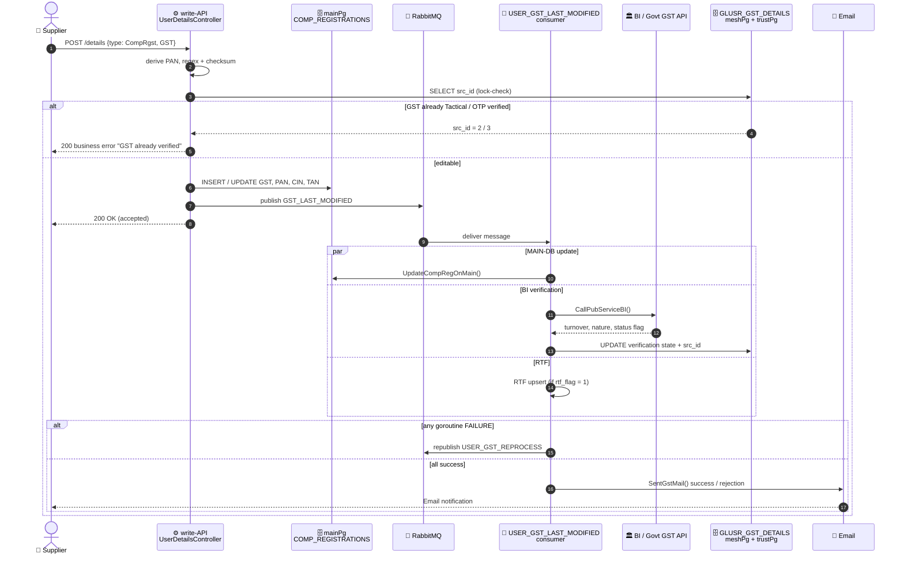

# GST — Technical Doc (Code-Level Deep Dive)

Yeh doc GST feature ka **technical implementation** cover karta hai — APIs, DB tables,
queries, RabbitMQ/Kafka, consumers, crons, sab kuch code se verify karke. Business/product
perspective ke liye [`GST_Business_Doc.md`](./GST_Business_Doc.md) dekho — dono docs same
flows cover karte hain, bas alag audience ke liye.

**Repos**: `users-api-go-production` (read), `service-api-go-production` (write),
`user-temp-consumers-production` (consumers + crons).

**Methodology**: har claim neeche real source code se trace kiya gaya hai (file path diya
gaya hai har jagah). Jahan code se pura confirm nahi ho paaya, wahan clearly
**[INFERRED — team se confirm karo]** likh diya hai, guess nahi kiya.

---

## 1. GST Kahan-Kahan Hai — File Map

| Concern | Repo | File |
|---|---|---|
| GST submit/update (general detail-editor ke through) | write | [`UserDetailsController.go`](../../service-api-go-production/service-api-go-production/internal/controllers/UserControllers/UserDetailsController.go), [`UserDetailsModel.go`](../../service-api-go-production/service-api-go-production/internal/models/UserModels/UserDetailsModel.go) |
| GST validation rules (regex, checksum, field map) | write | [`UsersValidationMaps.go`](../../service-api-go-production/service-api-go-production/internal/models/UserModels/UsersValidationMaps.go), [`UserUtilsMandatory.go`](../../service-api-go-production/service-api-go-production/internal/models/UserModels/UserUtilsMandatory.go) |
| GST→HSN mapping (write) | write | [`UserGSTHSNMappingController.go`](../../service-api-go-production/service-api-go-production/internal/controllers/UserControllers/UserGSTHSNMappingController.go), [`UserGSTHSNMappingModel.go`](../../service-api-go-production/service-api-go-production/internal/models/UserModels/UserGSTHSNMappingModel.go) |
| GST→HSN lookup (read) | read | [`GetHsnFromGstController.go`](../internal/controllers/UsersControllers/GetHsnFromGstController.go), [`UsersGetHsnFromGstModel.go`](../internal/models/users/UsersGetHsnFromGstModel.go) |
| GST detail read (company registration ke part ke roop mein) | read | [`UserOtherDetailModel.go`](../internal/models/users/UserOtherDetailModel.go) (type=CompRgst) |
| GST detail read (statutory aggregator) | read | [`StatutoryDetailsController.go`](../internal/controllers/UsersControllers/StatutoryDetailsController.go) |
| Daily re-verification cron (BigQuery-driven) | write repo `crons/` | `gst_tact_veri_cron.go` (package `main`, standalone binary, API binary ka part nahi) |
| Primary GST verification consumer | consumers | [`USER_GST_DETAILS.go`](../../user-temp-consumers-production/user-temp-consumers-production/internal/Workers/USER_GST_DETAILS.go) |
| GST change fan-out — general | consumers | [`USER_GST_LAST_MODIFIED.go`](../../user-temp-consumers-production/user-temp-consumers-production/internal/Workers/USER_GST_LAST_MODIFIED.go) |
| GST change fan-out — buyer-profile DB | consumers | [`USER_GST_LAST_MODIFIED_BUYERPROFILE.go`](../../user-temp-consumers-production/user-temp-consumers-production/internal/Workers/USER_GST_LAST_MODIFIED_BUYERPROFILE.go) |
| GST change fan-out — trust DB | consumers | [`USER_GST_LAST_MODIFIED_TRUSTPG.go`](../../user-temp-consumers-production/user-temp-consumers-production/internal/Workers/USER_GST_LAST_MODIFIED_TRUSTPG.go) |
| GST bulk sync (**Kafka-driven**, exception) | consumers | [`USER_GST_DETAILS_BULK.go`](../../user-temp-consumers-production/user-temp-consumers-production/internal/Workers/USER_GST_DETAILS_BULK.go) |
| Legal-status auto-computation | consumers | [`LEGAL_STATUS_COMPUTATION.go`](../../user-temp-consumers-production/user-temp-consumers-production/internal/Workers/LEGAL_STATUS_COMPUTATION.go) |
| HSN change audit-history | consumers | [`GST_HSN_HISTORY.go`](../../user-temp-consumers-production/user-temp-consumers-production/internal/Workers/GST_HSN_HISTORY.go) |
| **Dead/CSV-driven, live nahi hai** | consumers | [`gst_tact_cron_sync.go`](../../user-temp-consumers-production/user-temp-consumers-production/internal/Workers/gst_tact_cron_sync.go) — function `GSTScript` local CSV files (`data/src_1.csv`, `data/src_5.csv`) padhta hai, live queue nahi. Queue name bhi lowercase hai (`gst_tact_cron_sync`) jo baaki sab UPPERCASE queue names se alag hai — yeh khud ek signal hai ki yeh one-off tool tha, production pipeline nahi. |

---

## 2. Routes (confirmed from router.go)

| Method | Path | Repo | Controller |
|---|---|---|---|
| POST | `/details` (type=CompRgst) | write | `UserDetailsController` |
| POST | `/gsthsnmapping` | write | `UserGSTHSNMappingController` |
| GET/POST | `/gethsnfromgst/*params` | read | `ActionGetHsnFromGst` |
| GET | `/otherdetail` (type=CompRgst) | read | `UserOtherDetailController` |
| GET | `/statutory_details` | read | `StatutoryDetailsController` |

---

## 3. Data Model — Tables

> **Verification note**: yeh sab table/column names Go code ke andar embedded SQL strings se
> liye gaye hain (har row ke saamne file path diya hai). Live DB schema se pgAdmin pe
> cross-verify **nahi** kiya gaya hai — kisi migration/integration se pehle woh zaroor karo.

| Table | Physical DB | Purpose | Key columns (code se) |
|---|---|---|---|
| `GLUSR_USR_COMP_REGISTRATIONS` | mainPg (Oracle, legacy "MAIN-DB") + meshPg (Postgres) | **Primary business-registration record** — GST, PAN, CIN, TAN yahan store hote hain baaki company-reg fields ke saath | `FK_GLUSR_USR_ID`, `GST`, `GST_LAST_MODIFIED_DATE`, `GLUSR_USR_COMP_PAN_NUMBER`, `GLUSR_USR_COMP_CIN_NUMBER`, `GLUSR_USR_COMP_TAN_NUMBER`, `GLUSR_USR_COMP_REG_ID` — [`USER_GST_LAST_MODIFIED.go:840`](../../user-temp-consumers-production/user-temp-consumers-production/internal/Workers/USER_GST_LAST_MODIFIED.go) |
| `GLUSR_GST_DETAILS` | meshPg + trustPg (replicated) | **GST-specific verification-state record** — registration record se alag table hai | `GLUSR_GST_NO`, `FK_GST_VERIFICATION_SRC_ID`, `GST_PARTNER_NAME`, `GST_REGISTRATION_YEAR`, `GST_LEGAL_STATUS`, `GST_NATURE_OF_BUSINESS`, `GST_NATURE_OF_BUSINESS_SECONDARY`, `GST_ANNUAL_TURNOVER` — [`UserDetailsController.go:618`](../../service-api-go-production/service-api-go-production/internal/controllers/UserControllers/UserDetailsController.go), [`USER_GST_DETAILS.go`](../../user-temp-consumers-production/user-temp-consumers-production/internal/Workers/USER_GST_DETAILS.go) |
| `GST_TO_HSN_MAPPING` | meshpg | GST number aur HSN codes ke beech many-to-many link | `GST`, `HSN_CODE`, `ADDED_BY`, `ADDED_DATE` — [`UserGSTHSNMappingModel.go:16,85`](../../service-api-go-production/service-api-go-production/internal/models/UserModels/UserGSTHSNMappingModel.go) |
| `HSN_MASTER` | meshpg | HSN code reference/master data | `HSN_CODE`, `HSN_DESCRIPTION`, `HSN_TYPE` — [`UserGSTHSNMappingModel.go:243`](../../service-api-go-production/service-api-go-production/internal/models/UserModels/UserGSTHSNMappingModel.go) |
| `GL_ALL_MASTER_HISTORY` | meshPg | Generic cross-domain audit-history table (sirf GST ke liye nahi) — HSN insert/delete ka audit log yahan jaata hai | `GL_HISTORY_REF_ID`, `GL_HISTORY_TRANSACTION_TYPE` (`I`/`D`), `GL_HISTORY_NEW_VALUE`, `GL_HISTORY_OLD_VALUE`, `GL_HISTORY_COMMENTS` — [`GST_HSN_HISTORY.go`](../../user-temp-consumers-production/user-temp-consumers-production/internal/Workers/GST_HSN_HISTORY.go) |
| `GLUSR_USR` | meshPg | General user/company table — sirf `GLUSR_USR_COMPANYNAME` fetch karne ke liye padha jaata hai (legal-status LLP-name check ke liye) | [`LEGAL_STATUS_COMPUTATION.go:167`](../../user-temp-consumers-production/user-temp-consumers-production/internal/Workers/LEGAL_STATUS_COMPUTATION.go) |
| `iil_verification_details` (BigQuery) | BigQuery (`big-query-history-im.soa_user`) | Daily cron isse cross-reference karta hai recently-changed verification records dhoondne ke liye | `fk_glusr_usr_id`, `iil_verification_user_src_date`, `fk_gl_attribute_id` — `gst_tact_veri_cron.go:47` |
| `gl_history` (BigQuery) | BigQuery (`big-query-history-im.imhistory`) | Cron ka change-history source, kal ke GST/PAN/CIN/IEC/Udyam updates scan karne ke liye | `fk_glusr_usr_id`, `gl_history_update_date_trunc`, `gl_history_transaction_type` — `gst_tact_veri_cron.go:46` |
| `glust_gst_details` (BigQuery mirror) | BigQuery (`big-query-history-im.soa_user`) | `GLUSR_GST_DETAILS` ka BigQuery-side mirror, cron isse join karta hai | `glusr_gst_no`, `fk_gst_verification_src_id` — `gst_tact_veri_cron.go:50` |

---

## 4. GST Verification Source IDs (`FK_GST_VERIFICATION_SRC_ID`)

Yeh numeric code sabse important business rule ka basis hai. Meanings **error/log message
strings se reconstruct kiye gaye hain** — koi documented enum nahi mila. Isliye
**[INFERRED — BI/GST team se confirm karo customer-facing copy mein use karne se pehle]**:

| Value | Meaning (inferred) | Evidence |
|---|---|---|
| `1` | Naya / auto-matched via BI matchmaking (freshly submitted, abhi elevate nahi hua) | `UserDetailsController.go:652` isse not-yet-locked treat karta hai; `USER_GST_DETAILS.go:340` isse set karta hai jab BI API flag `2` ho |
| `2` | **Tactical Verified** | Error string: `"GST is already marked as Tactical Verified"` — `UserDetailsController.go:667-668` |
| `3` | **OTP Verified** | Error string: `"GST is already marked as OTP Verified"` — `UserDetailsController.go:669-670`. OTP-verification override bhi isi flag ko set karta hai — `USER_GST_DETAILS.go:549` |
| `4` | Rejected / recomputation chahiye (TACT cron specifically inhi ko re-check karta hai) | `gst_tact_veri_cron.go:52` filters `fk_gst_verification_src_id IN (1, 4, 5)`; `USER_GST_DETAILS.go:373` isse "OTP se override chahiye" treat karta hai |
| `5` | Manual Verification (human reviewer ke liye queue mein) | `USER_GST_DETAILS.go:418-419`, `USER_GST_LAST_MODIFIED.go:468` (`"MANUAL VERIFICATION"`) |

**Locking business rule**: Ek baar GST src_id `2` (Tactical) ya `3` (OTP) ho jaaye, toh
supplier normal profile-edit se usse **overwrite nahi kar sakta** — write reject hota hai
`"GST is already marked as Tactical Verified"` / `"...OTP Verified"` ke saath. Bypass sirf
do tarike se: (a) GLADMIN user jiske paas explicit screen-permission ho
(`checkScreenPermisson`), ya (b) supplier OTP se apna ownership prove kare — jo itna strong
proof maana jaata hai ki yeh ek auto-rejected state ko bhi override kar sakta hai.
[`UserDetailsController.go:658-676`](../../service-api-go-production/service-api-go-production/internal/controllers/UserControllers/UserDetailsController.go)

---

## 5. Business Rules & Validation (code se exhaustive list)

1. **Length**: GST exactly **15 characters** ka hona chahiye. Kam se kam teen alag jagah
   independently check hota hai (`UserDetailsController`, `UserGSTHSNMappingController`,
   `GetHsnFromGstController`) — koi single shared length-check function nahi hai.
2. **Format**: `components.Regex["GST"]` mein stored regex se match karna chahiye (pattern
   khud ek shared components/regex config file mein hai, inline nahi).
   [`UsersValidationMaps.go:2386`](../../service-api-go-production/service-api-go-production/internal/models/UserModels/UsersValidationMaps.go)
3. **Checksum**: regex se independent, `ValidateGSTINChecksum(val)` GSTIN check-digit
   algorithm validate karta hai. Regex AUR checksum dono pass hone chahiye.
   [`UserUtilsMandatory.go:2559`](../../service-api-go-production/service-api-go-production/internal/models/UserModels/UserUtilsMandatory.go)
4. **Test-GST bypass**: literal value `09AAACI5853L2Z5` ko validation fail karne ki explicit
   permission hai **sirf** agar submitting GLID ek hardcoded allowlist mein ho
   (`components.DetailsAPIIMGlids`) — yeh almost certainly ek QA/test fixture hai jo
   production code mein baked hai. Team ko flag karna worth hai agar yeh allowlist actively
   maintain nahi ho rahi.
   [`UserDetailsController.go:2387`](../../service-api-go-production/service-api-go-production/internal/controllers/UserControllers/UserDetailsController.go)
5. **Registration-screen exemption**: regex+checksum check poori tarah skip ho jaata hai
   agar `updatedbyScreen == "gluser registration screen(gladmin-vendor)"` — yaani ek specific
   internal onboarding screen ko unvalidated GST values submit karne ka trust diya gaya hai.
   [`UserDetailsController.go:2385`](../../service-api-go-production/service-api-go-production/internal/controllers/UserControllers/UserDetailsController.go)
6. **PAN inference**: agar 15-character GST submit hua, PAN number **automatically** GST
   string ke characters 3-12 slice karke nikal liya jaata hai (GSTIN design se hi PAN embed
   karta hai) — is flow mein supplier alag se PAN nahi deta.
   [`UserDetailsController.go:132-138`](../../service-api-go-production/service-api-go-production/internal/controllers/UserControllers/UserDetailsController.go)
7. **Khaali GST = deletion, no-op nahi**: `GST` key khaali value ke saath submit karna
   **delete** path trigger karta hai (`flag = "D"` in `UpdateGlusrGstDetails`), jo attribute
   ID `2106` (GST verification attribute) ko bhi force-unverify karta hai.
   [`USER_GST_LAST_MODIFIED.go:801-820`](../../user-temp-consumers-production/user-temp-consumers-production/internal/Workers/USER_GST_LAST_MODIFIED.go)
8. **GST verified hone ke baad PAN akela change nahi ho sakta**: agar sirf `pan_no` submit
   ho (GST nahi), aur existing record ka src_id `1`/`2`/`3` ho, toh write reject hota hai
   `"PAN cannot be updated as GST is marked as Verified"` ke saath.
   [`UserDetailsController.go:651-656`](../../service-api-go-production/service-api-go-production/internal/controllers/UserControllers/UserDetailsController.go)
9. **App-version gate**: `< 13.1.5` app version wale clients ke liye, agar GST *already*
   verified hai (koi bhi state), ek second, stricter check chalta hai
   (`fk_gl_attribute_id=2106` lookup `iil_verification_details` mein) aage badhne se pehle —
   ek backward-compatibility shim purane app builds ke liye jinme newer locking UI nahi tha.
   [`UserDetailsController.go:574-611`](../../service-api-go-production/service-api-go-production/internal/controllers/UserControllers/UserDetailsController.go)
10. **HSN de-duplication**: HSN↔GST links insert/delete karne se pehle, system requested
    change ko existing `GST_TO_HSN_MAPPING` ke against diff karta hai — already-linked HSN
    insert karna ya non-linked HSN delete karna silently filter ho jaata hai, error nahi hai.
    [`UserGSTHSNMappingModel.go: FilterHSN`](../../service-api-go-production/service-api-go-production/internal/models/UserModels/UserGSTHSNMappingModel.go)
11. **HSN input constraints**: submitted HSN codes purely numeric hone chahiye, ≤ 8 digits,
    aur `"0"` nahi — baaki sab silently insert/delete list se drop ho jaata hai.
    [`UserGSTHSNMappingController.go:132,148`](../../service-api-go-production/service-api-go-production/internal/controllers/UserControllers/UserGSTHSNMappingController.go)

---

## 6. Legal Status Auto-Computation (GST-6th-character trick)

**Logic**: GSTIN ke characters 1-2 state code hain, characters 3-12 PAN hai, aur character 15
(embedded PAN ka 6th character, i.e. `gst[5]` Go mein 0-indexed) PAN-holder ka legal-entity
type encode karta hai (Income Tax PAN structure rules ke hisaab se). IndiaMART isi ko reuse
karta hai "Company Type" auto-derive karne ke liye, supplier se poochta nahi.
[`LEGAL_STATUS_COMPUTATION.go:114-148`](../../user-temp-consumers-production/user-temp-consumers-production/internal/Workers/LEGAL_STATUS_COMPUTATION.go)

| GST 6th character (embedded PAN ka) | Computed legal status code | Meaning (PAN 4th-char convention se) |
|---|---|---|
| `F` | `3` (ya `6` agar company name "LLP" pe end hoti ho) | Firm / LLP |
| `P` | `4` | Individual/Proprietorship |
| `C` | `2` | Company |
| `H` | `15` | HUF (Hindu Undivided Family) |
| `A`, `T`, `B` | `5` | AOP / Trust / BOI |
| `J`, `G`, `L` | `12` | Artificial Juridical Person / Government / Local Authority |

**Precondition**: yeh sirf tab chalta hai jab message mein `gst_status == "verified"` ho —
yaani legal status sirf ek verified GST ke liye auto-set hota hai, freshly-submitted
unverified GST ke liye nahi. Agar GST unverified hai ya DB lookup fail ho, koi legal status
compute nahi hota, message bas acknowledge ho jaata hai without action.

**Trigger**: yeh consumer apni queue (`LEGAL_STATUS_COMPUTATION`) pe listen karta hai aur
`GLID` + `gst_status` keys wala message expect karta hai — **is exact message shape ka
publisher iss review mein conclusively nahi mila** (yaani konsa upstream step `PushToQueue`
call karta hai `SERVICENAME` iss queue pe map karke `gst_status` field ke saath). Follow-up
ke roop mein flag karo: team se confirm karo konsa step `LEGAL_STATUS_COMPUTATION` pe publish
karta hai.

---

## 7. RabbitMQ — GST Domain Mein Use Hone Waale Queues

GST domain ki poori messaging **RabbitMQ-based** hai shared `PushToQueue` / `PubAPI` /
`Requeue` helpers ke through (dekho [`utils_programming_guide.md`](../utils_programming_guide.md)
section 3) — **ek exception** ke saath (`USER_GST_DETAILS_BULK`, dekho section 8).

| Queue / `SERVICENAME` | Publisher | Consumer | Purpose |
|---|---|---|---|
| `GST_TO_HSN_MAPPING_SERVICE` → route `comp.sync.<glid%20>` pe | `UserGSTHSNMappingModel.go` (`GSTHSN_CompanyQueue`) | Downstream replica-sync consumers (generic `comp.sync.*` fan-out, GST-specific nahi) | Har GLID jo ek GST se linked hai unhe batao ki HSN mapping change hui |
| `GST_TO_HSN_HISTORY` | `UserGSTHSNMappingModel.go` (`CreatehsnHistory`) | [`GST_HSN_HISTORY.go`](../../user-temp-consumers-production/user-temp-consumers-production/internal/Workers/GST_HSN_HISTORY.go) | Har HSN insert/delete ke liye audit-history row likho |
| `USER_GST_DETAILS` | `gst_tact_veri_cron.go` (`PublishGstPackets`), aur dead `gst_tact_cron_sync.go` (`publishPacket`) | [`USER_GST_DETAILS.go`](../../user-temp-consumers-production/user-temp-consumers-production/internal/Workers/USER_GST_DETAILS.go) | GST/PAN/CIN/IEC/Udyam verification requests ka primary intake point |
| `GST_LAST_MODIFIED` (SERVICENAME) → queue `user.gst.*` pe resolve hota hai (`PushToQueue` ke map se) | Multiple write paths jab bhi GST/PAN/CIN/TAN actually value change kare | [`USER_GST_LAST_MODIFIED.go`](../../user-temp-consumers-production/user-temp-consumers-production/internal/Workers/USER_GST_LAST_MODIFIED.go) | Change ko MAIN-DB, RTF (authPg), aur `GLUSR_GST_DETAILS` verification tables mein fan-out karo, parallel goroutines mein |
| `USER_VERIFICATION_TRUSTPG` / `..._FAIL` | `USER_GST_DETAILS.go`, `USER_GST_LAST_MODIFIED.go` | (Trust-verification consumer, GST-specific scope se bahar) | Trust database ke against ek verification event record karo |
| `USER_GST_REPROCESS` | `USER_GST_LAST_MODIFIED.go`, kisi bhi partial failure pe (`mainStatus`/`rtfStatus`/`glusrGstDetailUpdate` == `"FAILURE"`) | *(iss review mein trace nahi kiya — likely `USER_GST_LAST_MODIFIED` khud pe loop back karta hai)* | Partial fan-out failures ke liye retry path |
| `USER_GST_LAST_MODIFIED_FAIL` | `USER_GST_LAST_MODIFIED.go` (`CallPubServiceBI`), external BI API failure pe | *(fail-queue, likely manually monitored ya auto-retried)* | Failed BI-matchmaking calls capture karo GST/PAN/IEC/UDYAM/CIN ke liye |
| `USER_TAN_MATCHMAKING_FAIL` | Same function, jab `attribute == "TAN"` | *(fail-queue)* | Same pattern, TAN-specific |
| `comp.sync.<glid%20>` | Multiple GST write paths | Generic company-sync consumers | Standard 20-way sharded "har downstream replica DB ko is company-level change ke baare mein batao" queue jo poore domain mein use hota hai, sirf GST ke liye exclusive nahi |

---

## 8. Kafka — Ek Real Touchpoint

Domain ki baaki har cheez ke ulat, **`USER_GST_DETAILS_BULK` Kafka-driven hai**, RabbitMQ
nahi:

```go
// user-temp-consumers-production/internal/Workers/USER_GST_DETAILS_BULK.go
func UserGstDetailsBulk(queueName string) {
    sub_topic := os.Getenv("sub_topic")
    consumerGroup := os.Getenv("consumer_group")
    ...
    go InitializeKafka(queueName, sub_topic, consumerGroup, dbstruct)
    ...
}
```

**Business purpose (inferred)**: naming (`_BULK`) aur yeh fact ki yeh RabbitMQ ki jagah
Kafka hai, strongly suggest karta hai ki yeh **bulk/batch GST master-data updates** ka intake
path hai BI GST team ke apne system se — ek high-throughput topic, one-GLID-at-a-time
RabbitMQ messages ki jagah. Yeh code shape se ek reasonable inference hai, confirmed fact
nahi — **BI/GST team se actual topic name aur publisher confirm karo.**

Koi aur GST-related code inn teeno repos mein Kafka touch nahi karta. Agar koi poochhe "kya
GST Kafka use karta hai," accurate answer hai: "sirf ek specific bulk-sync consumer ke liye;
real-time sab kuch RabbitMQ hai."

---

## 9. Redis

**GST domain mein Redis ka koi use kahin nahi mila** teeno repos mein. GST reads
(`GET /otherdetail`, `GET /gethsnfromgst`, `GET /statutory_details`) har request pe seedhe
Postgres hit karte hain — koi GST-specific caching layer nahi hai. Agar read latency in
endpoints pe concern ban jaaye, yeh ek genuine gap hai address karne layak (dekho section 12,
Optimization Scope).

---

## 10. End-to-End Technical Flows (step by step, code-level)

### Flow A — Supplier pehli baar GST submit karta hai

```
Supplier (seller panel/app)
    │
    ▼
[API — write] POST /details  {type: "CompRgst", GST: "...", ...}
    │  UserDetailsController.go
    │  1. GST substring se PAN auto-derive hota hai
    │  2. Mandatory-field + length/type validation (UserDetails_CompRgst map)
    │  3. Regex + checksum validation GST pe (jab tak registration-screen exempt na ho)
    │  4. Lock-check: kya iss GLID ke liye already Tactical/OTP-verified GST hai? (block agar haan)
    ▼
[DB — synchronous write]  GLUSR_USR_COMP_REGISTRATIONS (via UserDetailsModel)
    │
    ▼
[RabbitMQ publish]  SERVICENAME=GLUSR_UPDATE_SERVICE ya similar → USER_CENTRALIZED_QUEUE
    │  (standard account-update fan-out, GST-specific nahi — dekho
    │   account_creation_onboarding_read_write_picture.md)
    ▼
[RabbitMQ publish]  SERVICENAME=GST_LAST_MODIFIED → queue user.gst.*
    ▼
[CONSUME]  USER_GST_LAST_MODIFIED.go
    │  3 parallel goroutines fire karta hai:
    ├─ UpdateCompRegOnMain()      → GST/PAN/CIN/TAN MAIN-DB (mainPg) mein likhta hai
    ├─ GstRtfRequest()            → conditional RTF upsert authPg pe (sirf agar rtf_flag=1)
    └─ UpdateGstDetailsAndVerify()→ external BI GST Matchmaking API call karta hai,
                                     verification result GLUSR_GST_DETAILS (meshPg + trustPg)
                                     mein likhta hai
    │
    ├─ agar teeno succeed → done, GST_HSN/company-sync queue notified
    └─ agar koi fail ho → USER_GST_REPROCESS pe republish retry ke liye
    │
    ▼
[Email]  SentGstMail() — "Your GST has been updated Successfully" (ya rejection variant)
    │  skip hota hai: DEV mode, updater == GST_TACT_VERI_CRON, ya email file pe nahi hai
```

### Flow B — GST already verified, supplier usse change karne ki koshish karta hai

```
Supplier naya GST/PAN submit karta hai
    │
    ▼
[API] UserDetailsController check karta hai FK_GST_VERIFICATION_SRC_ID iss GLID ke liye
    │
    ├─ src_id == 2 ya 3 (Tactical/OTP verified) AUR purana GST != naya GST
    │       │
    │       ├─ caller GLADMIN hai m_id + updatedbyId ke saath aur checkScreenPermisson() pass karta hai
    │       │       → allowed to proceed
    │       │
    │       └─ warna → REJECTED
    │              "GST is already marked as Tactical Verified" / "...OTP Verified"
    │              (HTTP-level business error, DB write nahi)
    │
    └─ src_id == 1 (unverified) → allowed, Flow A pe proceed karta hai
```

### Flow C — Daily TACT re-verification cron (BigQuery → RabbitMQ)

```
[CRON — daily, standalone binary]  gst_tact_veri_cron.go
    │
    ▼
[BigQuery query]  gl_history + iil_verification_details + glust_gst_details
    │                + glusr_usr_comp_registrations + glusr_usr_udyam_details join karta hai
    │  filters: kal changed, attribute IDs {120,121,48,156,157,109,1293,1294,2074,1285}
    │
    ▼
Har changed GLID ke liye → PushToQueue → USER_GST_DETAILS
    (packet mein GST, PAN, CIN, IEC, Udyam numbers + FROM_CRON=1 flag hota hai)
    │
    ▼
[CONSUME]  USER_GST_DETAILS.go → VerifyGstDetails()
    │  FROM_CRON=1 behavior change karta hai:
    │  - CheckCurrValuesOnGlid() comparison trigger karta hai current DB state ke against
    │  - agar currently src_id==4 (rejected) → BI API se recompute, auto-approve/reject ho sakta hai
    │  - agar BI "auto rejected" (flag=4) return kare → DeleteGSTService() GST hataa deta hai
    │  - agar BI "manual" (flag=5) return kare → Manual Verification + Approval Attribute flow escalate hota hai
    │  - agar BI flag=2 return kare → src_id=2 (Tactical Verified) set ho jaata hai
    │
    ▼
Mail suppress hota hai cron-driven updates ke liye (updatedby == "GST_TACT_VERI_CRON")
```

**Failure alerting**: yeh cron email ya Kibana use nahi karta — failure pe seedha ek
**Google Chat/Spaces webhook** pe post karta hai (`utils.SendMessageToGoogleSpace`), ek
alag alerting channel baaki domain se — on-call ke liye janna zaroori hai.

### Flow D — GST → HSN mapping

```
GLADMIN/BI user
    │
    ▼
[API — write]  POST /gsthsnmapping  {GST, INS_HSN, DEL_HSN, ADDED_BY, VALIDATION_KEY}
    │  UserGSTHSNMappingController.go
    │  1. Gateway validation (sirf GLADMIN ya BI callers)
    │  2. GST length check (15 chars)
    │  3. Type/length validation (GstHsnMap)
    ▼
[DB read]  FilterHSN() — existing GST_TO_HSN_MAPPING rows ke against dedupe
    ▼
[DB write]  UpsertGSTHSN() — naye HSN links INSERT / removed wale DELETE
    ▼
[RabbitMQ]  GST_TO_HSN_HISTORY → GST_HSN_HISTORY.go audit row likhta hai GL_ALL_MASTER_HISTORY mein
    ▼
[RabbitMQ]  har GLID jiska company iss GST ke under registered hai, unhe →
             comp.sync.<glid%20> pe notify kiya jaata hai naye HSN list + descriptions ke saath
             (HSN_MASTER se joined)
```

### Flow E — GST data wapas read karna

| Endpoint | Repo | Kya return karta hai |
|---|---|---|
| `GET /otherdetail?type=CompRgst` | read | GST samet poora company-registration record — [`UserOtherDetailModel.go`](../internal/models/users/UserOtherDetailModel.go) |
| `GET`/`POST /gethsnfromgst/*params` | read | Ek given GST se mapped HSN codes (15-char validated, `is_desc` flag descriptions include karta hai ya nahi control karta hai) — [`GetHsnFromGstController.go`](../internal/controllers/UsersControllers/GetHsnFromGstController.go) |
| `GET /statutory_details` | read | GST ko baaki statutory/compliance attributes ke saath aggregate karke ek response mein deta hai |

---

## 11. Flow-wise DB & Table Usage — Kaun sa DB, Kaun sa Table, Kis Liye

Har flow (section 10 se) mein exactly kaun-kaun se physical database aur table touch hote
hain, kya data nikala/likha jaata hai, aur kyun — sab code se confirmed hai, jahan koi cheez
fully trace nahi ho payi wahan explicitly bola gaya hai.

### Flow A — GST Submit/Update (ek write, 4 databases touch hote hain)

| # | DB (physical) | Table | Operation | Kya nikala/likha jaata hai, aur kyun |
|---|---|---|---|---|
| 1 | meshpg (write-API se via `GetPGDbConnection`) | `GLUSR_GST_DETAILS` | SELECT | Lock-check: purana GST + `FK_GST_VERIFICATION_SRC_ID` nikala jaata hai, taaki decide ho sake supplier ko edit karne diya jaaye ya reject karna hai (section 4 ka locking rule) |
| 2 | **mainPg** (Oracle, legacy "MAIN-DB") | `GLUSR_USR_COMP_REGISTRATIONS` | SELECT (`Get_gst_pan_cin_tan`) phir INSERT/UPDATE (`UpdateCompRegOnMain`) | Purane GST/PAN/CIN/TAN values nikale jaate hain (compare karne ke liye ki kya sach mein change hua), phir naya value likha jaata hai — yeh **primary registration record** hai |
| 3 | mainPg | `GLUSR_USR` | SELECT (`GetGlusrData`) | Supplier ka Naam, Mobile, Email, Company Name nikala jaata hai — sirf confirmation email bhejne ke liye |
| 4 | authPg | RTF-related table (exact naam confirm nahi hua, `RtfUpsert` ke andar) | UPSERT | Sirf conditional (`rtf_flag=1`) — "Real Time Feed" framework ko update karta hai, GST-specific nahi lagta, generic mechanism reuse ho raha hai |
| 5 | **meshPg** | `GLUSR_GST_DETAILS` | SELECT (`CheckCurrValuesOnGlid`) phir INSERT/UPDATE (`UpdateGlusrGstDetails`) | Verification-state record likha/update hota hai — turnover, business nature, registration date, verification src_id sab yahan jaate hain |
| 6 | **trustPg** | `GLUSR_GST_DETAILS` (replica) | UPDATE (same `UpdateGlusrGstDetails` call, dono connections ek saath leta hai) | Trust database ka apna GST-verification copy sync mein rakhne ke liye |
| 7 | approvalPg | Approval-attribute table (`ApprovalAttribute`/`DeletefromPG` ke andar, exact naam confirm nahi hua) | INSERT/DELETE | Sirf jab `GST_APP_ATTR_PACKET` message mein ho — attribute-level approval workflow track karta hai |

**Total DB round-trips ek single GST-change event ke liye: kam se kam 9-10** (7 alag
operations upar, plus kuch ke andar internally multiple queries — jaise `CheckCurrValuesOnGlid`
khud ek alag SELECT hai). Yeh 4 alag physical databases (mainPg, meshPg, trustPg, approvalPg)
pe fail hote hain — parallel goroutines mein bantay hue (3-way split: MAIN-DB, RTF, GST
verification), lekin har goroutine ke andar sequential hai.

### Flow B — Locked GST Reject

| # | DB | Table | Operation | Kyun |
|---|---|---|---|---|
| 1 | meshpg | `GLUSR_GST_DETAILS` | SELECT only | Sirf current `FK_GST_VERIFICATION_SRC_ID` check karne ke liye — koi write nahi hota is path mein, isliye yeh sabse fast/cheap flow hai |

### Flow C — Daily TACT Cron (sabse zyada DB-heavy flow)

| # | DB | Table(s) | Operation | Kyun |
|---|---|---|---|---|
| 1 | **BigQuery** | `gl_history` + `iil_verification_details` + `glust_gst_details` + `glusr_usr_comp_registrations` + `glusr_usr_udyam_details` — **5-way JOIN** | SELECT (single query) | Pichle 24 ghante mein GST/PAN/CIN/IEC/Udyam change hue GLIDs dhoondhta hai. Yeh ek analytical query hai — BigQuery isliye use hota hai kyunki yeh cross-table historical scan hai, jo transactional Postgres pe efficient nahi hota |
| 2+ | *(Flow A ke sabhi steps reuse hote hain har matched GLID ke liye)* | — | — | Cron sirf ek trigger hai — har GLID ke liye poora Flow A/verification chain dobara chalta hai (`USER_GST_DETAILS` → `VerifyGstDetails` → same meshPg/trustPg writes) |
| 3 | meshPg | `GLUSR_GST_DETAILS` | SELECT (`CheckCurrValuesOnGlid`, `FROM_CRON=1` path mein specifically call hota hai) | Current verified value ke against naya BI response compare karta hai, decide karta hai auto-approve/reject/manual |

**Business-critical insight**: yeh cron potentially **saare** changed GLIDs (kal ke) ke liye
poora Flow A trigger karta hai — agar kisi din bahut zyada GST changes hue (jaise koi bulk
GST-refresh event), yeh cron ek saath bahut saare `USER_GST_DETAILS` messages publish karega,
jo aage Flow A ki poori DB-heavy chain trigger karenge. Yeh ek natural load-spike source hai.

### Flow D — GST → HSN Mapping

| # | DB | Table | Operation | Kyun |
|---|---|---|---|---|
| 1 | meshpg | `GST_TO_HSN_MAPPING` | SELECT (`FilterHSN`) | Existing HSN links nikale jaate hain, taaki duplicate insert/invalid delete filter ho sake |
| 2 | meshpg | `GST_TO_HSN_MAPPING` | INSERT (naye HSN) | Naye GST-HSN links save karta hai |
| 3 | meshpg | `GST_TO_HSN_MAPPING` | DELETE (removed HSN) | Purane links hatata hai |
| 4 | meshpg | `GLUSR_USR_COMP_REGISTRATIONS` | SELECT | Yeh dhoondta hai kaun-kaun se GLID iss GST se registered hain — unhe notify karne ke liye |
| 5 | meshpg | `HSN_MASTER` | SELECT | Naye HSN codes ke description/type nikalta hai, notification packet ke liye |
| 6 | meshPg (consumer side, `GST_HSN_HISTORY.go`) | `GL_ALL_MASTER_HISTORY` | SELECT (nextval sequence) → INSERT → SELECT-back (master IDs) | Audit-trail entry banata hai — **teen alag round-trips ek hi audit-write ke liye** (dekho section 12, optimization point #3) |

### Flow E — GST Reads

| # | DB | Table | Operation | Kyun |
|---|---|---|---|---|
| 1 | read-API ki DB (meshpg-equivalent) | `GLUSR_USR_COMP_REGISTRATIONS` + related columns | SELECT | `GET /otherdetail?type=CompRgst` — poora company-registration record deta hai |
| 2 | read-API ki DB | `GST_TO_HSN_MAPPING` (+ shayad `HSN_MASTER` description ke liye) | SELECT | `GET /gethsnfromgst` — GST se linked HSN codes deta hai |
| 3 | multiple (statutory aggregator ke through) | Multiple tables/downstream services | SELECT (fan-out) | `GET /statutory_details` — GST ko baaki statutory attributes ke saath ek response mein combine karta hai |

---

## 12. Optimization Scope — DB Response-Time Contribution

**Seedha jawaab tumhare sawaal ka: haan, DB clearly response-time ka sabse bada contributor
hai iss domain mein — lekin ek jagah external API call bhi utna hi bada culprit hai.** Neeche
concrete, code-se-verified optimization opportunities hain, priority order mein:

### High-impact

1. **Synchronous external BI API call andar consumer ke critical path mein hai.**
   `CallPubServiceBI()` (called from `USER_GST_DETAILS.go` aur `USER_GST_LAST_MODIFIED.go`)
   ek **network call bahar ke government-backed system ko** hai, aur yeh consumer ke message
   processing ko block karta hai jab tak response na aaye. Agar BI API slow ho (jo external
   dependencies aksar hoti hain), poori GST verification queue backlog ban sakti hai —
   isse DB se bhi zyada asar padh sakta hai response time pe, kyunki yeh ek network hop hai
   jiske upar humara control nahi hai. **Suggestion**: timeout tighten karo agar already
   nahi hai, aur agar possible ho toh iske liye ek dedicated queue/worker-pool alag karo taaki
   yeh baaki fast DB-only consumers ko block na kare.

2. **`GST_HSN_HISTORY.go` ek audit-write ke liye 3 sequential DB round-trips karta hai**
   (section 11, Flow D #6): pehle ek `nextval()` sequence query, phir ek INSERT, phir ek
   SELECT-back sirf newly-inserted `GL_HISTORY_MASTER_ID` values nikalne ke liye.
   **Concrete fix**: Postgres ka `INSERT ... RETURNING GL_HISTORY_MASTER_ID` use karo — yeh
   teen round-trips ko ek mein convert kar dega. Yeh sabse easy, lowest-risk optimization hai
   iss poore doc mein.
   [`GST_HSN_HISTORY.go:166,207,264`](../../user-temp-consumers-production/user-temp-consumers-production/internal/Workers/GST_HSN_HISTORY.go)

3. **`UserGSTHSNMappingController` 5 sequential queries chalata hai ek hi HTTP request mein**
   (dedupe SELECT → INSERT → DELETE → GLID SELECT → HSN_MASTER SELECT), bina kisi parallelism
   ke, jabki Query2 (INSERT) aur Query3 (DELETE) ek doosre pe depend nahi karte — yeh do
   Go goroutines mein parallel chal sakte hain. Similarly Query4 aur Query5 bhi independent
   hain agar Query4 ka result pehle mil chuka ho. **Estimated saving**: agar har query ~50-100ms
   le rahi hai, parallelizing independent pairs se total request time ~30-40% tak kam ho
   sakta hai.

### Medium-impact

4. **Koi caching nahi hai kisi bhi GST read endpoint pe** (section 9) — `GET /otherdetail`,
   `GET /gethsnfromgst`, `GET /statutory_details` sab har request pe live Postgres hit karte
   hain. GST data bahut infrequently change hota hai per-supplier (verified GST toh locked
   hi rehta hai, section 4) — yeh **ek natural caching candidate** hai. Redis infra already
   codebase mein hai ([`utils_programming_guide.md`](../utils_programming_guide.md) section 1)
   — bas iss domain mein wire nahi kiya gaya. Ek 10-15 minute TTL cache-aside pattern
   (`RedisGet` → miss pe DB → `RedisSet`) is significant read-latency drop de sakta hai bina
   correctness risk ke, kyunki verified GST records rarely change.

5. **Legal-status consumer aur GST-verification consumer dono independently GST value
   query karte hain same GLID ke liye, close time pe.** `LEGAL_STATUS_COMPUTATION.go`
   (`getGst`) apna khud ka `SELECT GST FROM GLUSR_USR_COMP_REGISTRATIONS` chalata hai, jabki
   `USER_GST_LAST_MODIFIED.go` ne abhi-abhi wahi GST value likha/verify kiya tha usi request
   ke andar. **Concrete fix**: GST value ko queue message ke andar hi pass kar do
   (`gst_status` ke saath `GST` bhi include karo) — legal-status consumer ko dobara DB query
   karne ki zaroorat hi nahi padegi. (Yeh section 6 ke open question se bhi link hai — pehle
   confirm karo publisher kaun hai, phir yeh optimization propose karo.)

6. **4 alag physical Postgres connections khulte hain per-message in `USER_GST_LAST_MODIFIED`**
   (mainPg, meshPg, approvalPg, trustPg) — connection pooling already hai (`SetMaxOpenConns(15)`
   per [`db.go`](../../user-temp-consumers-production/user-temp-consumers-production/pkg/utils/db.go)),
   lekin agar iss consumer ka concurrency/fan-out factor high set hai (section 4,
   `utils_programming_guide.md`), high message-volume ke time pe **connection-pool
   exhaustion** ka risk hai across 4 databases simultaneously. Worth monitoring dev/prod
   connection-pool saturation metrics agar GST-write volume kabhi spike kare.

### Low-impact / good-practice already present

7. **Positive finding, not a problem**: `USER_GST_LAST_MODIFIED.go` already teen independent
   operations (MAIN-DB update, RTF request, GST-verify+BI-call) ko **parallel goroutines**
   mein chala raha hai (`sync.WaitGroup`), jo ek achi optimization pattern hai already in
   place — yeh sequential hota toh response time aur bhi zyada hota. Baaki consumers
   (`USER_GST_DETAILS.go` jaise) yeh pattern follow nahi karte — agar unke andar bhi
   independent DB calls hain, unhe bhi isi pattern se parallelize kiya ja sakta hai.

---

## 12A. Full Flow Diagrams (Lucid, icon-based)

**[Poora GST flowchart yahan dekho](https://lucid.app/lucidchart/201924af-3e6b-41ae-9c53-a4f4fa7a7183/edit)**
— 6 pages, proper vendor icons (API Gateway, RabbitMQ, BigQuery, Postgres per-DB, Lambda for
consumers, external-cloud for BI API) ke saath:

| Page | Content |
|---|---|
| **0. Superset — All Flows** | Ek hi page pe poora GST domain — sab actors, APIs, queues, consumers, 4 databases, BI API, aur reads — high-level overview ke liye |
| **A. GST Submit-Update** | Section 10 Flow A ka detailed version — 3 parallel goroutines, 4 databases, email notification |
| **B. Locked GST Reject** | Section 10 Flow B — decision-tree jaisa: verified check → GLADMIN permission check → allow/reject |
| **C. Daily TACT Cron** | Section 10 Flow C — BigQuery 5-way join se leke BI API response ke teen outcomes (auto-approve/manual/auto-reject) tak, plus Google Chat failure-alert path |
| **D. GST-HSN Mapping** | Section 10 Flow D — dedupe → upsert → audit-history (3-round-trip highlight) → company-notify fan-out |
| **E. GST Reads** | Section 10 Flow E — teeno read endpoints, aur "No Redis cache anywhere" gap explicitly highlighted (lal dashed line se) |

Superset page pe **saara flow ek saath** dikhta hai; agar kisi specific case ka detail chahiye
(jaise sirf "GST reject hone pe kya hota hai"), uska alag page (B) dekho — superset ko
individual flows mein todne ka yehi tareeka hai jo tumne poocha tha.

---

## 12B. Data Flow Diagram (DFD — Level 1)

Yeh DFD dikhata hai **data kahan se kahan flow karta hai** — external entities (👤 / 🏛️),
numbered processes (⚙️), aur data stores (🗄️ / 📨). Har flow (section 10 A–E) yahan ek saath
map hua hai. Data-store notation: `D1..D5` persistent tables, `Q` message queues.



---

## 12C. Sequence Diagram — Flow A (GST Submit + Verify)

Section 10 Flow A ka time-ordered view — synchronous API path, phir async consumer ke andar
3 parallel goroutines, BI API call, aur email. `alt` blocks lock-reject aur failure-retry
branches dikhate hain.



---

## 13. Cron Inventory

| Cron | Live hai? | Trigger | Kya karta hai |
|---|---|---|---|
| `gst_tact_veri_cron.go` / `.sh` | **Haan, live** | Scheduled (daily, external scheduler — shell wrapper) | BigQuery scan kal ke GST/PAN/CIN/IEC/Udyam changes ke liye → `USER_GST_DETAILS` pe republish recomputation ke liye |
| `gst_tact_cron_sync.go` (`GSTScript`) | **Nahi — dead/CSV-driven** | Queue name `gst_tact_cron_sync` ke under registered, lekin local files `data/src_1.csv`/`data/src_5.csv` padhta hai, live queue nahi | One-off/manual reconciliation tool: ek CSV ke expected `(glid, gst, src_id)` triples ko live DB value se compare karta hai aur sirf match hone pe `USER_GST_DETAILS` pe republish karta hai. [`user_consumers_reference.md`](../user_consumers_reference.md) mein non-wired "fake consumer" ke roop mein flagged hai. |

---

## 14. Edge Cases & Business-Rule Gotchas (technical POV)

1. **Do alag "GST tables" hain, confuse hona easy hai**: `GLUSR_USR_COMP_REGISTRATIONS`
   (registration/PAN/CIN/TAN record) vs. `GLUSR_GST_DETAILS` (verification-state record). Ek
   ko change karne se doosra automatically sync nahi hota — `USER_GST_LAST_MODIFIED`
   consumer explicitly dono ko parallel goroutines mein update karta hai, aur failures ko
   `USER_GST_REPROCESS` ke through reconcile karta hai.
2. **Verified GST normal users ke liye one-way door hai** — ek baar Tactical/OTP-verified,
   sirf OTP re-proof ya permissioned GLADMIN action isse change kar sakta hai. Support
   tickets "main apna GST edit kyun nahi kar pa raha" — pehle `FK_GST_VERIFICATION_SRC_ID`
   check karo.
3. **Legal status trigger fragile hai** — yeh depend karta hai ek message pe jisme
   `gst_status` exactly string `"verified"` ke equal ho; iss exact message shape ka
   publisher conclusively identify nahi hua (dekho section 6). Agar legal status naye
   suppliers ke liye silently update hona band ho jaaye, check karo upstream publisher ka
   message shape drift toh nahi hua.
4. **Hardcoded test-GST bypass** (`09AAACI5853L2Z5`, section 5.4) ek production code path
   hai jo sirf hardcoded GLID allowlist se gated hai — security/hygiene review layak.
5. **Mail suppression logic teen near-identical functions mein spread hai** — DEV-mode
   override, cron-updater suppression, aur "no email on file" case har `SentGstMail` call
   site pe thoda alag handle hota hai; agar email behavior change karna ho, sab call sites
   audit karne padenge, ek nahi.
6. **Kahin bhi caching nahi hai** (section 9) — har GST read live DB hit hai. Current read
   volume pe theek hoga presumably, lekin janna zaroori hai isse pehle ki koi assume kare
   Redis kahin involved hai iss domain mein.
7. **App-version-gated double-validation** (section 5.9) — `< 13.1.5` app client ek *extra*
   DB round-trip trigger karta hai standard flow shuru hone se pehle bhi. Agar yeh version
   threshold kabhi app team ke release notes mein bump ho jaaye, yeh backend gate permanently
   inert code ban jaata hai jo phir bhi purane clients ke har request pe ek query cost karta
   rehta hai jab tak remove na ho.

---

## 15. Open Questions — BI/GST Team Ke Liye

Yeh cheezein sirf code se conclusively answer nahi ho paayin, finalize karne se pehle confirm
karo:

1. `FK_GST_VERIFICATION_SRC_ID` values `1`-`5` ka exact business meaning confirm karo
   (section 4) — current mapping log-message strings se reconstruct kiya gaya hai, koi
   documented enum nahi hai.
2. `LEGAL_STATUS_COMPUTATION` queue message `gst_status` key ke saath kaun/kya publish karta
   hai (section 6)? Iss review mein nahi mila.
3. `USER_GST_DETAILS_BULK` ka exact Kafka topic/producer kya hai (section 8)? BI-side bulk
   GST master-data feed inferred hai, confirmed nahi.
4. `09AAACI5853L2Z5` test-GST allowlist (section 5.4, 12.4) abhi bhi ek intentional,
   actively maintained QA fixture hai, ya ek stale artifact jo remove hona chahiye?
5. Har table (section 3) ka live DB schema verification (column types, nullability, indexes,
   constraints) — yeh doc sirf Go SQL strings jo imply karti hain wahi reflect karta hai.

---

## See also

- [`GST_Business_Doc.md`](./GST_Business_Doc.md) — same flows, product/business perspective,
  bina code ke
- [`../trust_verification_compliance_product_overview.md`](../trust_verification_compliance_product_overview.md) / [`../trust_verification_compliance_read_write_picture.md`](../trust_verification_compliance_read_write_picture.md) — GST ka role bigger Trust & Compliance story mein
- [`../utils_programming_guide.md`](../utils_programming_guide.md) — shared `PushToQueue`/`PubAPI`/Kafka/Redis helpers jo iss doc mein reference hue hain
- [`../user_consumers_reference.md`](../user_consumers_reference.md) — poori consumer inventory, `gst_tact_cron_sync` ke dead-consumer flag samet
